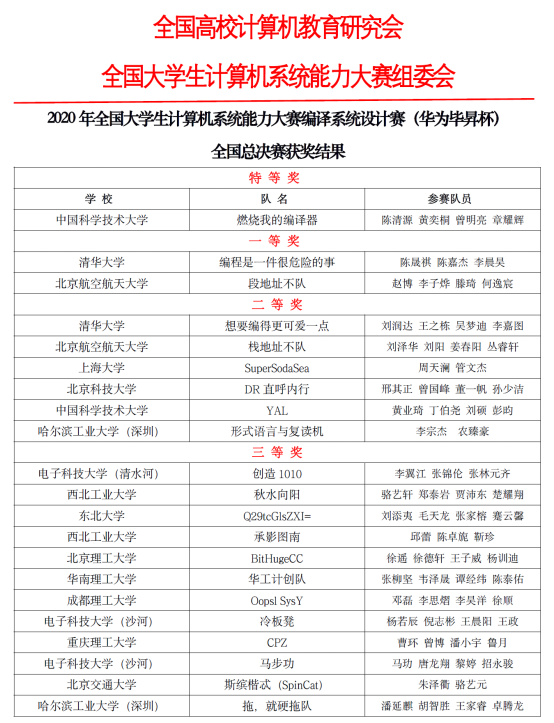
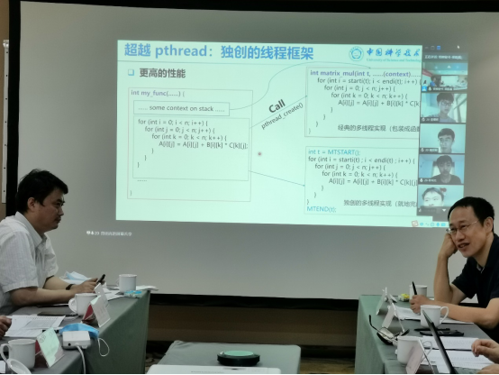

2020年中国大学生计算机系统能力大赛首届编译系统设计赛全国总决赛暨颁奖典礼于8月19-21日在线上和西北工业大学成功举行。该赛事是由教育部高等学校计算机类专业教学指导委员会和系统能力培养研究专家组共同发起，以学科竞赛推动专业建设和计算机领域创新人才培养体系改革、培育我国高端芯片及核心系统的技术突破与产业化后备人才为目标,面向高校大学生举办的全国性大赛。来自清华大学、中国科学技术大学、北京航空航天大学等47所高校的72支队伍报名参赛。 
我校派出的由计算机学院本科生陈清源、黄奕桐、曾明亮，网络空间安全学院本科生章耀辉组成的“燃烧我的编译器”队以及由少年班学院本科生黄业琦、计算机学院本科生丁伯尧、刘硕、彭昀组成的“YAL”队参加了线上总决赛，由计算机学院李诚老师和网络空间安全学院李卫海老师共同指导，计算机学院张昱老师作为特邀专家参加了本次总决赛。在历时2个月的初赛后，全部72支参赛队伍中仅有21支队进入总决赛。各决赛队在经过8月19-20日持续36小时紧张激烈的编译器优化工作和在线性能评测，以及21日的线上答辩后，由组委会10位专家评审与合议并发布获奖名次。我校“燃烧我的编译器”队以总分第一的优异成绩获得唯一的特等奖，捧起了“华为毕昇杯”；“YAL”队获得了二等奖。李诚、李卫海老师获得“优秀指导教师”奖。 

受到疫情影响，参赛学生较长时间无法返校进行实验工作，但指导教师通过搭建远程测试平台等方式成功克服实验器材困难，帮助同学们完成了核心代码调试和性能测评。在6-8月间，指导老师与同学们开展了多轮校内线上研讨会，认真备赛。

“燃烧我的编译器”队的同学们设计思路清晰，分工明确，配合默契，在比赛中展示了强大的创新和工程实践能力。他们巧妙地设计了程序的三层中间表式，并提出基于多线程的轻量级自动并行等优化方法，在有限的比赛时间里实现了30余个优化遍。最终，他们设计的编译器为测试用例生成了高性能可执行代码，大部分用例的运行速度明显快于开启-O3高级优化后的主流编译器GCC，荣获特等奖。“YAL”队的同学们虽在初赛中因队员有其他比赛等事情而使进度严重滞后，在临近初赛结束时又遇到极为复杂的技术难题，但在同学们和老师的通力配合之下，依靠顽强拼搏的精神，在高度紧张的比赛气氛中承受住压力，扭转了不利局面，顺利挺进决赛，荣获二等奖。

我校计算机类课程体系建设秉承基础宽厚实，专业高精尖的理念，重视学生“系统能力”的培养，相关改革成效凸显，成为全国8所“系统能力培养示范高校”之一。近年来，计算机学院编译课程组在课堂和实验教学两方面均进行了卓有成效的改革，部分理念走在国内高校前列。该课程组的老师强调实践在课程教学中的重要性，注重实践内容的系统性和综合性以及过程管理，采取多元化测评方法来考核学生的表现。他们积极增删课程内容，及时把最新理论和技术通过精心构造的实践案例及课程教案等反映到教学中。他们较早地将新兴技术(如LLVM、RISC-V、深度学习等)引入到实验框架建设中，培养学生掌握新开发工具以及比较、评价、选择不同方法的能力，激发学生学习的热情和促进对其创新能力的培养。这一系列的改革在同学们中引起了较好的反响，也为这次比赛取得佳绩奠定了重要的基础。

教务处、计算机学院、网络空间安全学院、信息学院和少年班学院的大力支持为本次比赛队员选拔、培训和线上参赛创造了多项有力条件。我校参赛队员通过细致认真的备赛，良好的团队协作和冷静沉着的表现在本次比赛中取得了优异成绩，展现了我校学生扎实的专业水平、良好的系统思维与创新能力、全面的综合素质。

（[转自中国科学技术大学新闻网](http://news.ustc.edu.cn/info/1055/72780.htm)）

